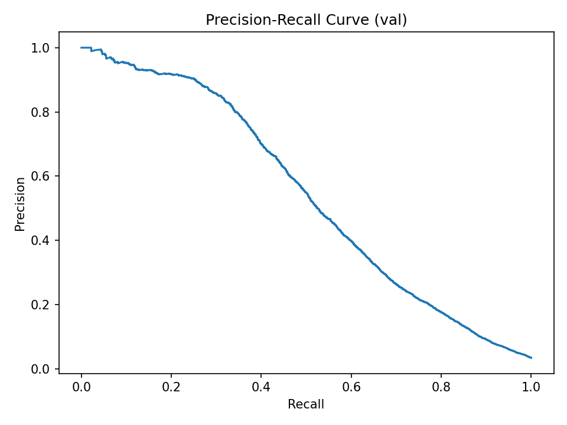
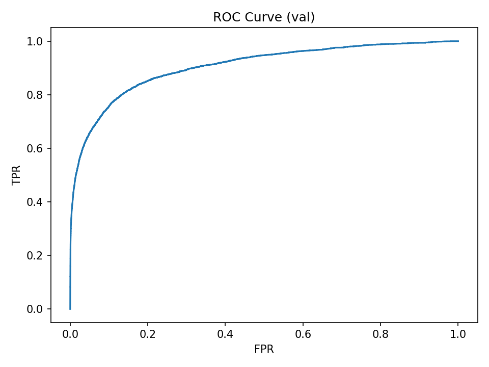
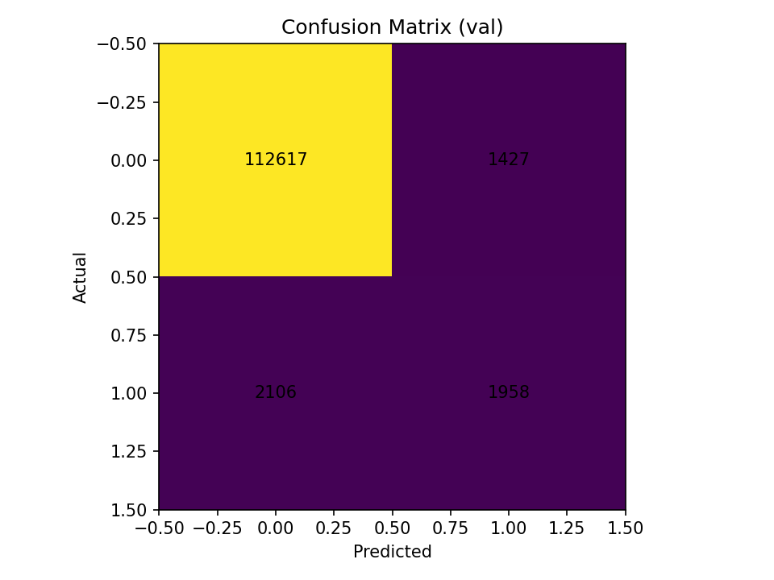
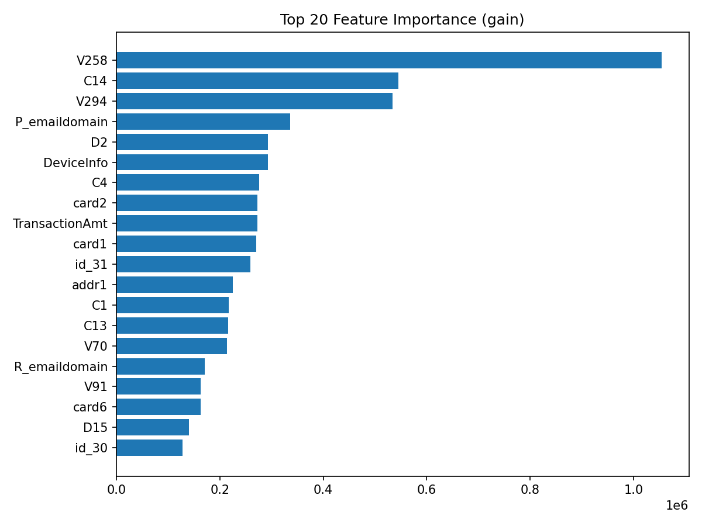
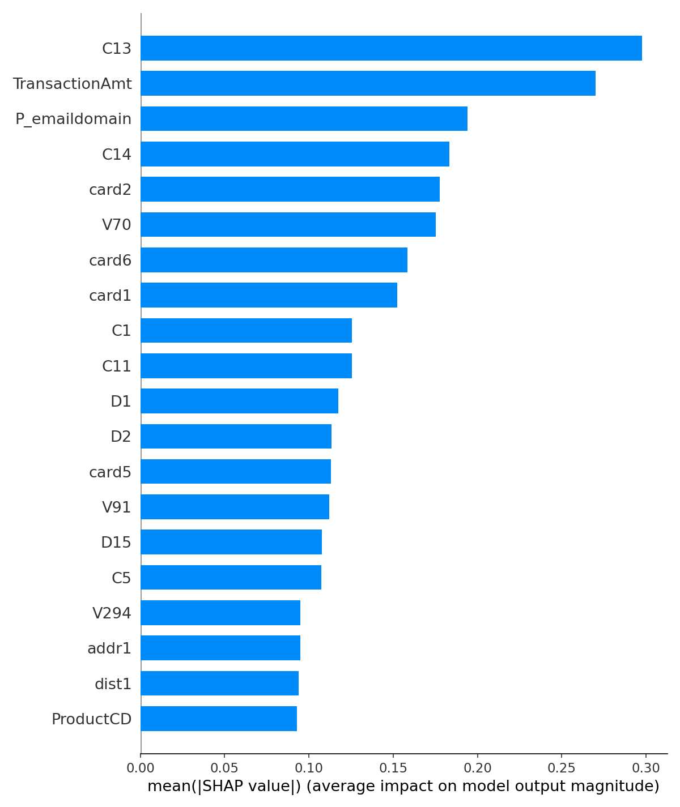

# IEEE-CIS Fraud Detection (ML + Explainability)

This repo is a reproducible ML project using the Kaggle IEEE-CIS Fraud Detection dataset.
Workflow: EDA -> LightGBM baseline -> evaluation -> SHAP explainability.

## Results (time-based split)
- Split: 80/20 by TransactionDT
- PR-AUC: 0.5427
- ROC-AUC: 0.9052
- Best-F1 threshold: 0.7293

## Visuals
**PR Curve**


**ROC Curve**


**Confusion Matrix**


**Top Feature Importance**


**SHAP Summary**



## Structure
- notebooks/ : EDA only
- src/       : training/eval/explain scripts
- configs/   : parameters (paths, split)
- reports/   : metrics + figures

## Setup

```bash
python3 -m venv .venv
source .venv/bin/activate
pip install -r requirements.txt


## How to Run (reproducible)

```bash
source .venv/bin/activate

# 1) Train baseline (LightGBM)
python -m src.train_lgbm --config configs/baseline.yaml

# 2) Evaluate (PR/ROC curves, confusion matrix, feature importance)
python -m src.evaluate --config configs/baseline.yaml

# 3) Explain (SHAP)
python -m src.explain --config configs/baseline.yaml

